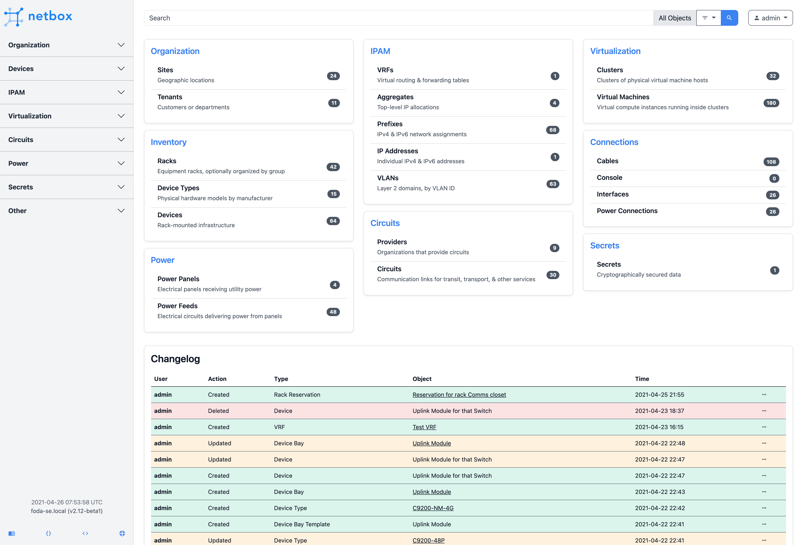
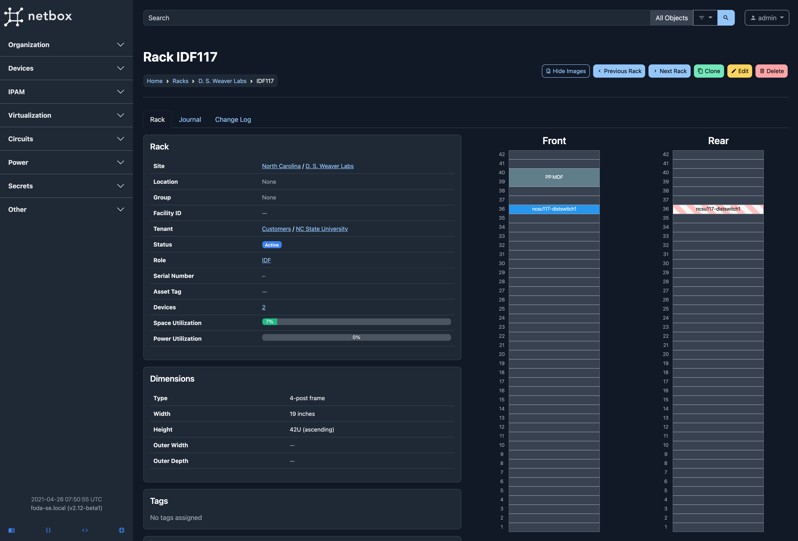
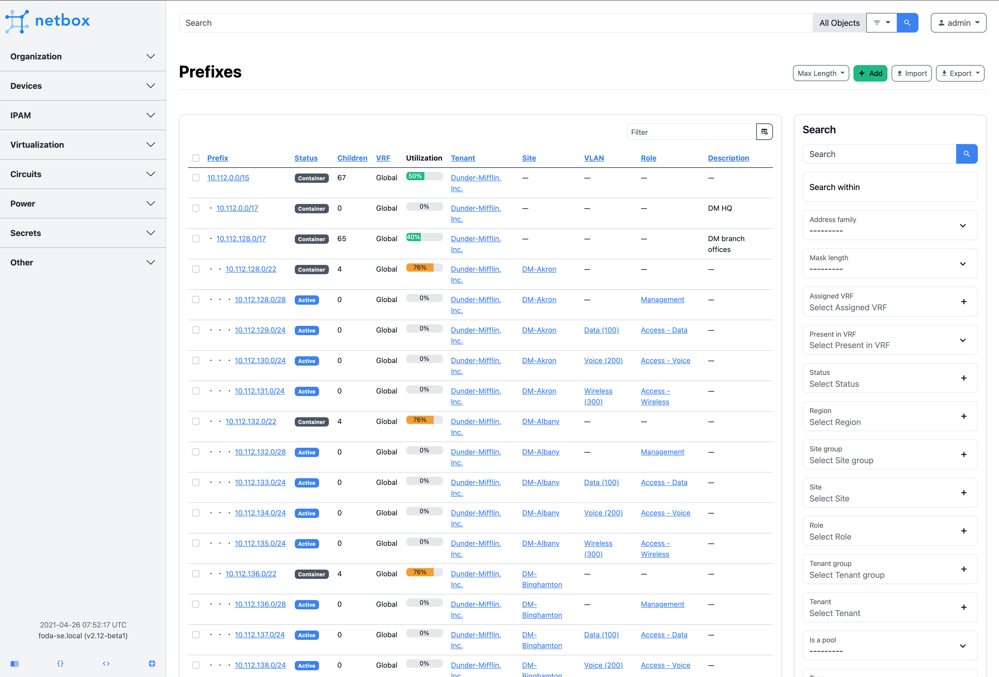
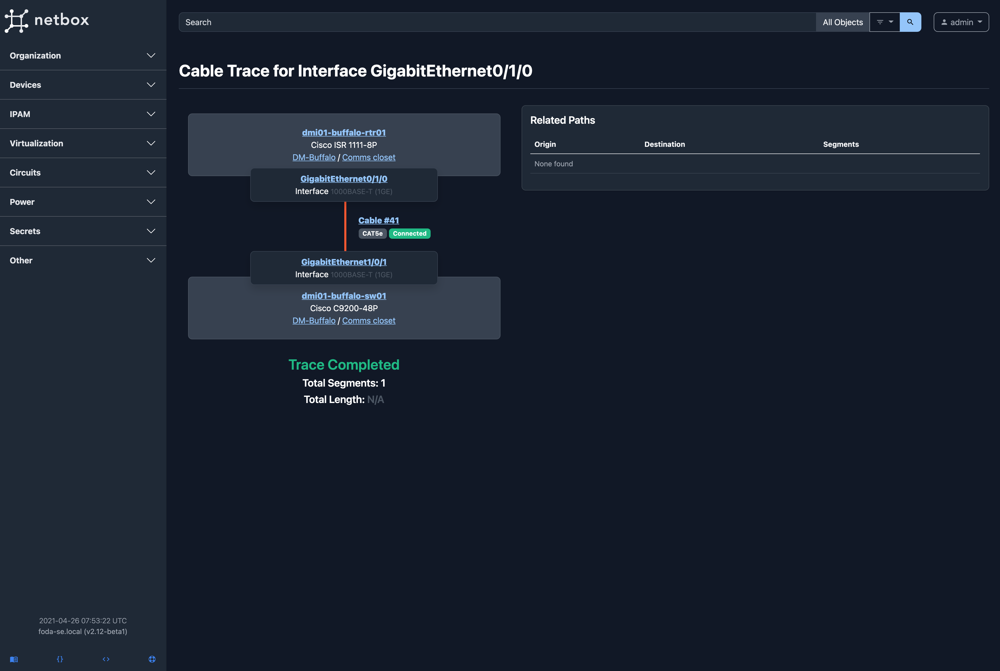

NetBox is an IP address management (IPAM) and data center infrastructure
management (DCIM) tool. Initially conceived by the network engineering team at
[DigitalOcean](https://www.digitalocean.com/), NetBox was developed specifically
to address the needs of network and infrastructure engineers. It is intended to
function as a domain-specific source of truth for network operations.

NetBox runs as a web application atop the [Django](https://www.djangoproject.com/)
Python framework with a [PostgreSQL](https://www.postgresql.org/) database. For a
complete list of requirements, see `requirements.txt`. The code is available [on GitHub](https://github.com/netbox-community/netbox).

The complete documentation for NetBox can be found at [Read the Docs](https://netbox.readthedocs.io/en/stable/). A public demo instance is available at https://demo.netbox.dev.

### Discussion

* [GitHub Discussions](https://github.com/netbox-community/netbox/discussions) - Discussion forum hosted by GitHub; ideal for Q&A and other structured discussions
* [Slack](https://slack.netbox.dev/) - Real-time chat hosted by the NetDev Community; best for unstructured discussion or just hanging out
* [Google Group](https://groups.google.com/g/netbox-discuss) - Legacy mailing list; slowly being replaced by GitHub discussions

### Build Status

|             | status                                                                                            |
| ----------- | ------------------------------------------------------------------------------------------------- |
| **master**  |   |
| **develop** |  |

### Screenshots

---

---

---

## Installation

Please see [the documentation](https://netbox.readthedocs.io/en/stable/) for
instructions on installing NetBox. To upgrade NetBox, please download the
[latest release](https://github.com/netbox-community/netbox/releases) and
run `upgrade.sh`.

## Providing Feedback

The best platform for general feedback, assistance, and other discussion is our
[GitHub discussions](https://github.com/netbox-community/netbox/discussions).
To report a bug or request a specific feature, please open a GitHub issue using
the [appropriate template](https://github.com/netbox-community/netbox/issues/new/choose).

If you are interested in contributing to the development of NetBox, please read
our [contributing guide](CONTRIBUTING.md) prior to beginning any work.

## Related projects

Please see [our wiki](https://github.com/netbox-community/netbox/wiki/Community-Contributions)
for a list of relevant community projects.
