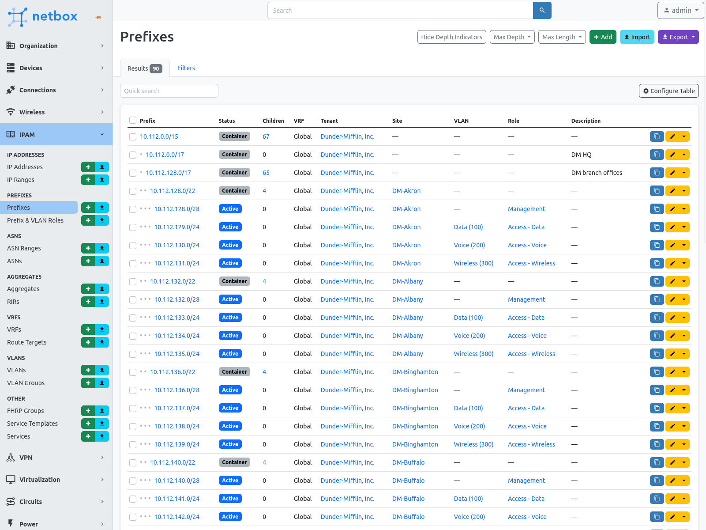
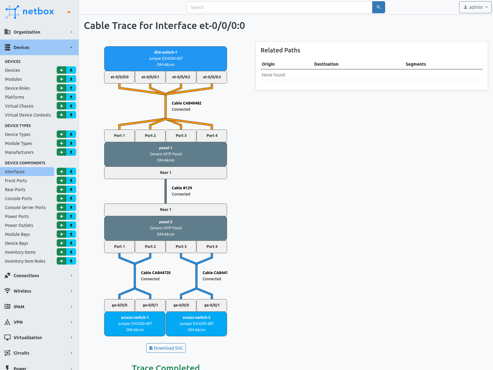

  

NetBox is an infrastructure resource modeling (IRM) tool designed to empower
network automation, used by thousands of organizations around the world.
Initially conceived by the network engineering team at
[DigitalOcean](https://www.digitalocean.com/), NetBox was developed specifically
to address the needs of network and infrastructure engineers. It is intended to
function as a domain-specific source of truth for network operations.

Myriad infrastructure components can be modeled in NetBox, including:

* Hierarchical regions, site groups, sites, and locations
* Racks, devices, and device components
* Cables and wireless connections
* Power distribution
* Data circuits and providers
* Virtual machines and clusters
* IP prefixes, ranges, and addresses
* VRFs and route targets
* FHRP groups (VRRP, HSRP, etc.)
* AS numbers
* VLANs and scoped VLAN groups
* Organizational tenants and contacts

In addition to its extensive built-in models and functionality, NetBox can be
customized and extended through the use of:

* Custom fields
* Custom links
* Configuration contexts
* Custom model validation rules
* Reports
* Custom scripts
* Export templates
* Conditional webhooks
* Plugins
* Single sign-on (SSO) authentication
* NAPALM integration
* Detailed change logging

NetBox also features a complete REST API as well as a GraphQL API for easily
integrating with other tools and systems.

NetBox runs as a web application atop the [Django](https://www.djangoproject.com/)
Python framework with a [PostgreSQL](https://www.postgresql.org/) database. For a
complete list of requirements, see `requirements.txt`. The code is available [on GitHub](https://github.com/netbox-community/netbox).

The complete documentation for NetBox can be found at [Read the Docs](https://netbox.readthedocs.io/en/stable/). A public demo instance is available at https://demo.netbox.dev.

  <h4>Thank you to our sponsors!</h4>

  
  &nbsp;&nbsp;&nbsp;&nbsp;&nbsp;&nbsp;&nbsp;&nbsp;&nbsp;&nbsp;
  
  &nbsp;&nbsp;&nbsp;&nbsp;&nbsp;&nbsp;&nbsp;&nbsp;&nbsp;&nbsp;
  
   
  

### Discussion

* [GitHub Discussions](https://github.com/netbox-community/netbox/discussions) - Discussion forum hosted by GitHub; ideal for Q&A and other structured discussions
* [Slack](https://netdev.chat/) - Real-time chat hosted by the NetDev Community; best for unstructured discussion or just hanging out
* [Google Group](https://groups.google.com/g/netbox-discuss) - Legacy mailing list; slowly being replaced by GitHub discussions

### Installation

Please see [the documentation](https://netbox.readthedocs.io/en/stable/) for
instructions on installing NetBox. To upgrade NetBox, please download the
[latest release](https://github.com/netbox-community/netbox/releases) and
run `upgrade.sh`.

### Providing Feedback

The best platform for general feedback, assistance, and other discussion is our
[GitHub discussions](https://github.com/netbox-community/netbox/discussions).
To report a bug or request a specific feature, please open a GitHub issue using
the [appropriate template](https://github.com/netbox-community/netbox/issues/new/choose).

If you are interested in contributing to the development of NetBox, please read
our [contributing guide](CONTRIBUTING.md) prior to beginning any work.

### Screenshots

")

")

### Related projects

Please see [our wiki](https://github.com/netbox-community/netbox/wiki/Community-Contributions)
for a list of relevant community projects.
