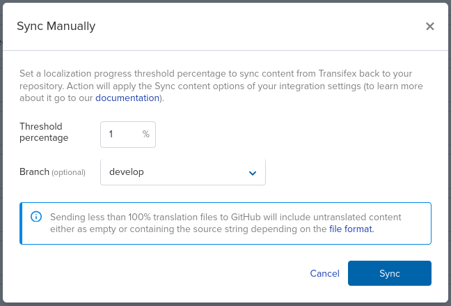
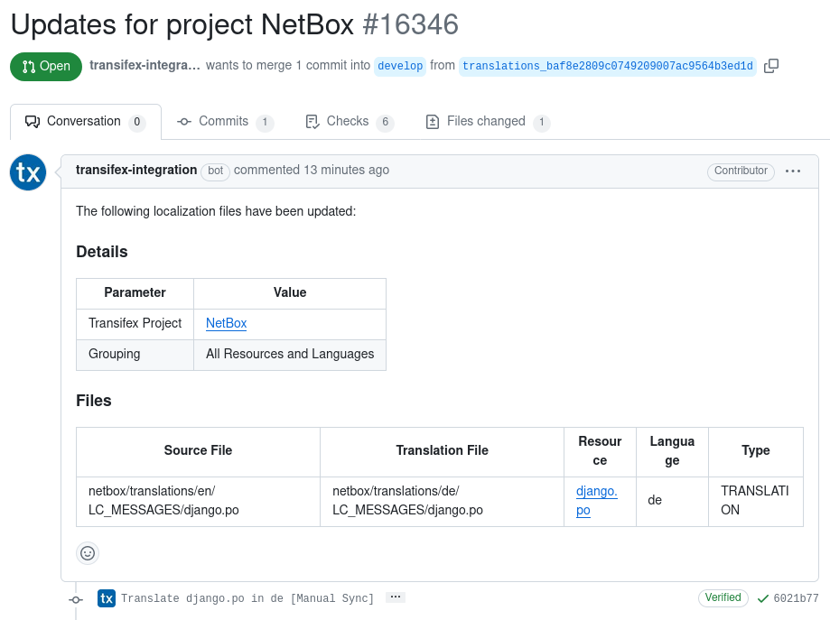

# Translations

NetBox coordinates all translation work using the [Transifex](https://explore.transifex.com/netbox-community/netbox/) platform. Signing up for a Transifex account is free.

All language translations in NetBox are generated from the source file found at `netbox/translations/en/LC_MESSAGES/django.po`. This file contains the original English strings with empty mappings, and is generated as part of NetBox's release process. Transifex updates source strings from this file on a recurring basis, so new translation strings will appear in the platform automatically as it is updated in the code base.

Reviewers log into Transifex and navigate to their designated language(s) to translate strings. The initial translation for most strings will be machine-generated via the AWS Translate service. Human reviewers are responsible for reviewing these translations and making corrections where necessary.

## Updating Translation Sources

To update the English `.po` file from which all translations are derived, use the `makemessages` management command (ignoring the `project-static/` directory):

```nohighlight
./manage.py makemessages -l en -i "project-static/*"
```

Then, commit the change and push to the `develop` branch on GitHub. Any new strings will appear for translation on Transifex automatically.

## Updating Translated Strings

Typically, translated strings need to be updated only as part of the NetBox [release process](./release-checklist.md).

To update translated strings, start by initiating a sync from Transifex. From the Transifex dashboard, navigate to Settings > Integrations > GitHub > Manage, and click the **Manual Sync** button at top right.



Enter a threshold percentage of 1 (to ensure all translations are captured) and select the `develop` branch, then click **Sync**. This will initiate a pull request to GitHub to update any newly modified translation (`.po`) files.

!!! tip
    The new PR should appear within a few minutes. If it does not, check that there are in fact new translations to be added.



Once the PR has been merged, the updated strings need to be compiled into new `.mo` files so they can be used by the application. Update the `develop` branch locally to pull in the changes from the Transifex PR, then run Django's [`compilemessages`](https://docs.djangoproject.com/en/stable/ref/django-admin/#django-admin-compilemessages) management command:

```nohighlight
./manage.py compilemessages
```

Once any new `.mo` files have been generated, they need to be committed and pushed back up to GitHub. (Again, this is typically done as part of publishing a new NetBox release.)

## Proposing New Languages

If you'd like to add support for a new language to NetBox, the first step is to [submit a GitHub issue](https://github.com/netbox-community/netbox/issues/new?assignees=&labels=type%3A+translation&projects=&template=translation.yaml) to capture the proposal. While we'd like to add as many languages as possible, we do need to limit the rate at which new languages are added. New languages will be selected according to community interest and the number of volunteers who sign up as translators.

Once a proposed language has been approved, a NetBox maintainer will:

* Add it to the Transifex platform
* Designate one or more reviewers
* Create the initial machine-generated translations for review
* Add it to the list of supported languages
