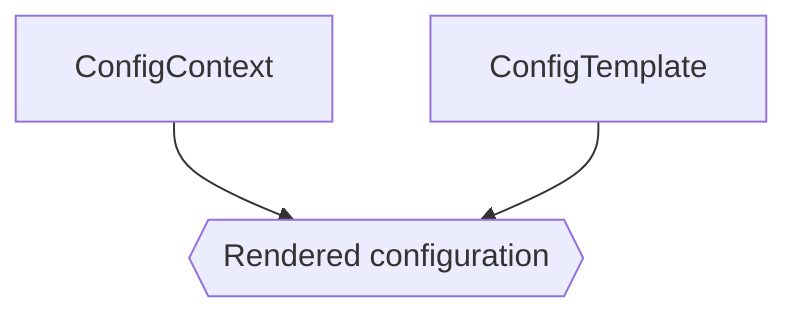

# Configuration Rendering

One of the critical aspects of operating a network is ensuring that every network node is configured correctly. By leveraging configuration templates and [context data](./context-data.md), NetBox can render complete configuration files for each device on your network.



## Configuration Templates

Configuration templates are written in the [Jinja2 templating language](https://jinja.palletsprojects.com/), and may be automatically populated from remote data sources. Context data is applied to a template during rendering to output a complete configuration file. Below is an example template.

```jinja2



    system {
        host-name {{ device.name }};
        domain-name example.com;
        time-zone UTC;
        authentication-order [ password radius ];
        ntp {
            
                server {{ server }};
            
        }
    }
    
        
    

```

When rendered for a specific NetBox device, the template's `device` variable will be populated with the device instance, and `ntp_servers` will be pulled from the device's available context data. The resulting output will be a valid configuration segment that can be applied directly to a compatible network device.
