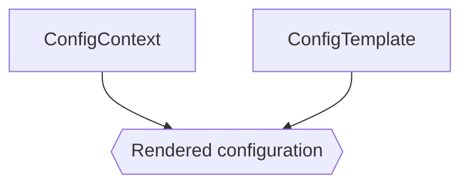

# Configuration Rendering

One of the critical aspects of operating a network is ensuring that every network node is configured correctly. By leveraging configuration templates and [context data](./context-data.md), NetBox can render complete configuration files for each device on your network.



## Configuration Templates

Configuration templates are written in the [Jinja2 templating language](https://jinja.palletsprojects.com/), and may be automatically populated from remote data sources. Context data is applied to a template during rendering to output a complete configuration file. Below is an example Jinja2 template which renders a simple network switch configuration file.

```jinja2



    system {
        host-name {{ device.name }};
        domain-name example.com;
        time-zone UTC;
        authentication-order [ password radius ];
        ntp {
            
                server {{ server }};
            
        }
    }
    
        
    

```

When rendered for a specific NetBox device, the template's `device` variable will be populated with the device instance, and `ntp_servers` will be pulled from the device's available context data. The resulting output will be a valid configuration segment that can be applied directly to a compatible network device.

### Context Data

The objet for which the configuration is being rendered is made available as template context as `device` or `virtualmachine` for devices and virtual machines, respectively. Additionally, NetBox model classes can be accessed by the app or plugin in which they reside. For example:

```
There are {{ dcim.Site.objects.count() }} sites.
```

## Rendering Templates

### Device Configurations

NetBox provides a REST API endpoint specifically for rendering the default configuration template for a specific device. This is accomplished by sending a POST request to the device's unique URL, optionally including additional context data.

```no-highlight
curl -X POST \
-H "Authorization: Token $TOKEN" \
-H "Content-Type: application/json" \
-H "Accept: application/json; indent=4" \
http://netbox:8000/api/dcim/devices/123/render-config/ \
--data '{
  "extra_data": "abc123"
}'
```

This request will trigger resolution of the device's preferred config template in the following order:

* The config template assigned to the individual device
* The config template assigned to the device's role
* The config template assigned to the device's platform

If no config template has been assigned to any of these three objects, the request will fail.

### General Purpose Use

NetBox config templates can also be rendered without being tied to any specific device, using a separate general purpose REST API endpoint. Any data included with a POST request to this endpoint will be passed as context data for the template.

```no-highlight
curl -X POST \
-H "Authorization: Token $TOKEN" \
-H "Content-Type: application/json" \
-H "Accept: application/json; indent=4" \
http://netbox:8000/api/extras/config-templates/123/render/ \
--data '{
  "foo": "abc",
  "bar": 123
}'
```
