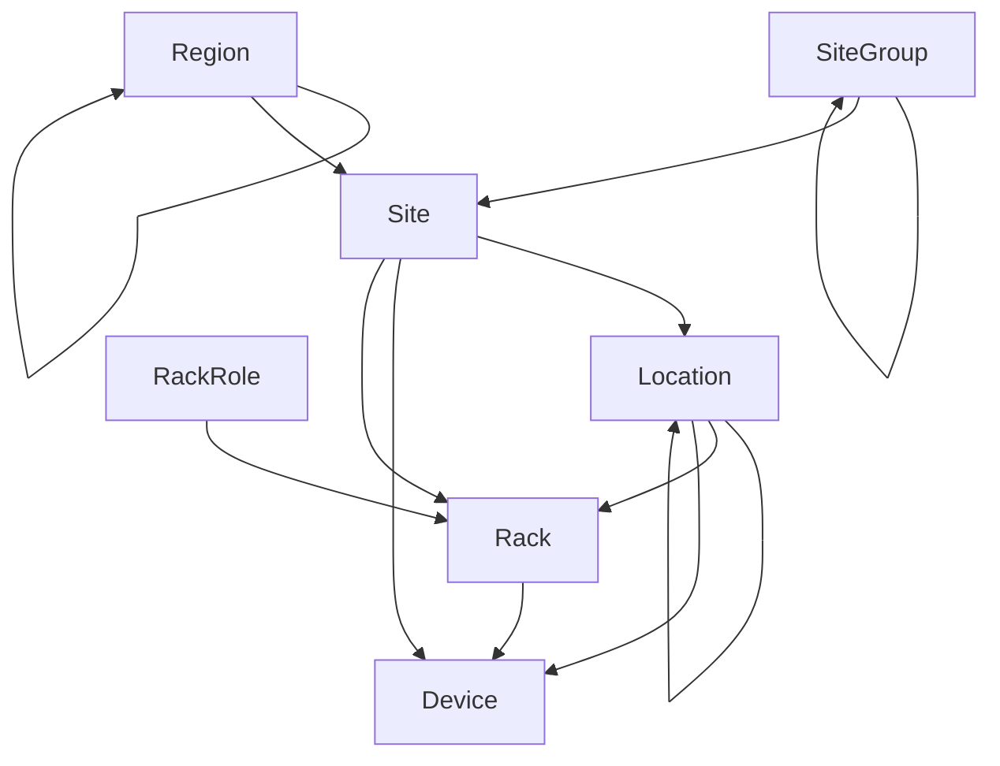

# Facilities

From global regions down to individual equipment racks, NetBox allows you to model your network's entire presence. This is accomplished through the use of several purpose-built models. The graph below illustrates these models and their relationships.

## Regions

Regions represent geographic domains in which your network or its customers have a presence. These are typically used to model countries, states, and cities, although NetBox does not prescribe any precise uses and your needs may differ.

Regions are self-nesting, so you can define child regions within a parent, and grandchildren within each child. For example, you might create a hierarchy like this:

* Europe
    * France
    * Germany
    * Spain
* North America
    * Canada
    * United States
        * California
        * New York
        * Texas

Regions will always be listed alphabetically by name within each parent, and there is no maximum depth for the hierarchy.

## Site Groups

Like regions, site groups can be arranged in a recursive hierarchy for grouping sites. However, whereas regions are intended for geographic organization, site groups may be used for functional grouping. For example, you might classify sites as corporate, branch, or customer sites in addition to where they are physically located.

The use of both regions and site groups affords to independent but complementary dimensions across which sites can be organized.

## Sites

A site typically represents a building within a region and/or site group. Each site is assigned an operational status (e.g. active or planned), and can have a discrete mailing address and GPS coordinates assigned to it.

## Locations

A location can be any logical subdivision within a building, such as a floor or room. Like regions and site groups, locations can be nested into a self-recursive hierarchy for maximum flexibility. And like sites, each location has an operational status assigned to it.

## Racks

Finally, NetBox models each equipment rack as a discrete object within a site and location. These are physical objects into which devices are installed. Each rack can be assigned an operational status, type, facility ID, and other attributes related to inventory tracking. Each rack also must define a height (in rack units) and width, and may optionally specify its physical dimensions.

Each rack must be associated to a site, but the assignment to a location within that site is optional. Users can also create custom roles to which racks can be assigned. NetBox supports tracking rack space in half-unit increments, so it's possible to mount devices at e.g. position 2.5 within a rack.

!!! tip "Devices"
    You'll notice in the diagram above that a device can be installed within a site, location, or rack. This approach affords plenty of flexibility as not all sites need to define child locations, and not all devices reside in racks.
