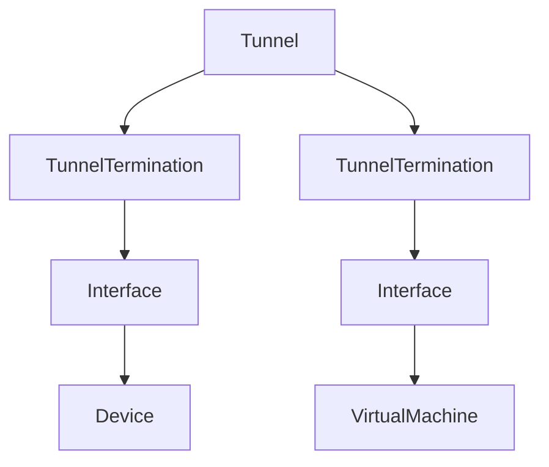
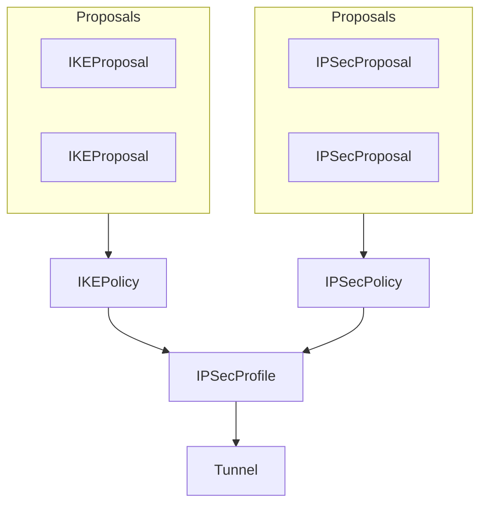

# Tunnels

NetBox can model private tunnels formed among virtual termination points across your network. Typical tunnel implementations include GRE, IP-in-IP, and IPSec. A tunnel may be terminated to two or more device or virtual machine interfaces. For convenient organization, tunnels may be assigned to user-defined groups.

# IPSec & IKE

NetBox includes robust support for modeling IPSec & IKE policies. These are used to define encryption and authentication parameters for IPSec tunnels.

